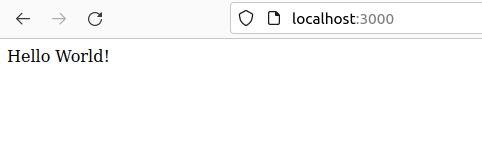
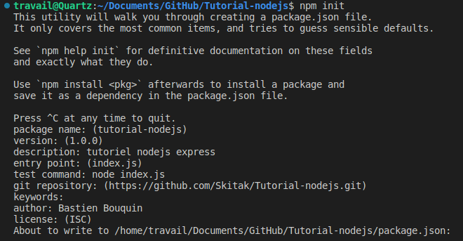
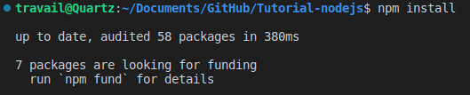
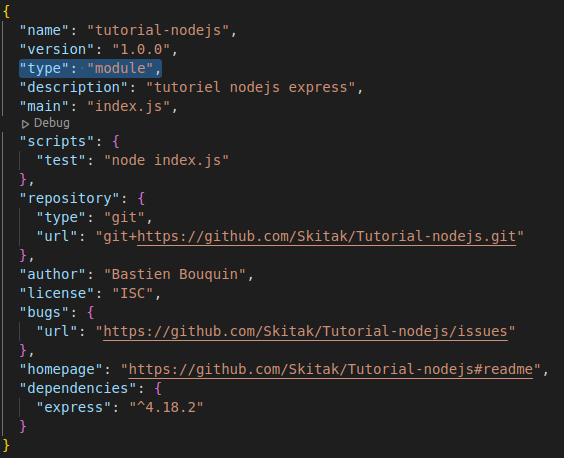
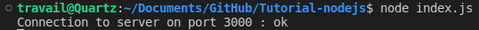
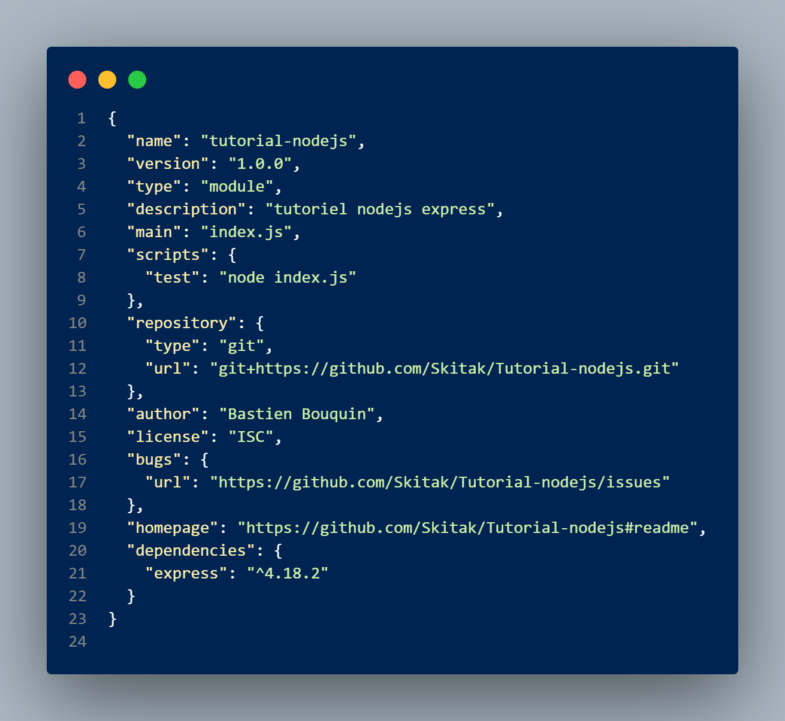
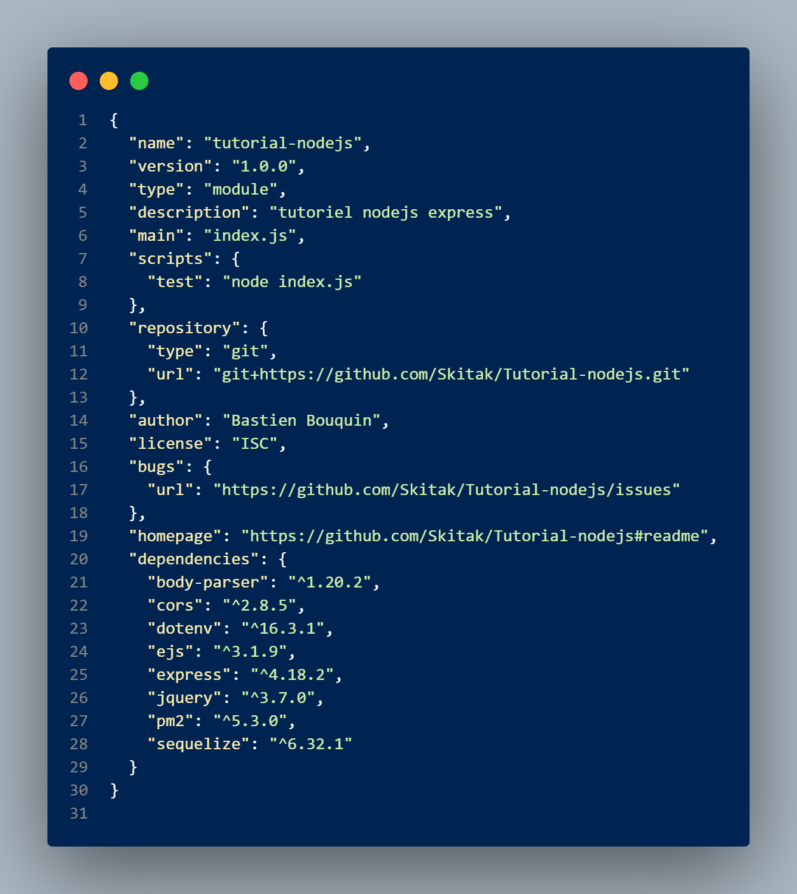

# Tutorial nodejs

Tutoriel Node Js

Note :
Les lignes à faire dans la console sont entourées de \*\*\*

\*\*\* 
`ma ligne de commande`
 \*\*\* 

Le download de nodejs (18.12 LTS) : https://nodejs.org/en/

# Exercice 1 - NPM et Hello world

Npm est un outil qui s'occupe de gérer les librairies dont on a besoin pour faire fonctionner notre site web.
*Pas besoin de l'installer, il vient tout seul avec l'installation de nodejs le malin*

## Faire fonctionner le projet git

Note :
Cette section décrit comment faire fonctionner le code que tu as pull.
La section pour faire le projet est un peu plus bas.

### Installer les librairies

Si tu viens de pull le projet, tu vas lancer cette ligne de commande :

\*\*\* 
`npm install`
 \*\*\* 
Cette commande sert à installes les dépendances définies dans packages.json

### Lancer le serveur

\*\*\* 
`node index.js`
 \*\*\* 

#### Tester

http://localhost:3000  
 

## Faire le projet de A à Z

### Initialiser npm

\*\*\* 
`npm init`
 \*\*\* 
  
npm init est une commande qui va générer le fichier de configuration "package.json".
Dans ce fichier, on va indiquer les librairies dont on a besoin mais aussi des informations liées au projet (autheurs, licences, etc ).

### Installer Express

\*\*\* 
`npm install express`
 \*\*\* 
  
Express est un framework très light qui facilite l'utilisation de node.
Le fichier de configuration package.json a été modifie pour y répertorier express comme librairie dans la section "dependencies".

### Utiliser les derniers standards javascript ES6

Ajouter au fichier de configuration package.json la ligne `"type": "module",` cela permet d'utiliser les derniers standards javascript. 
  

## Premier Hello world

Créer un fichier à la racine du projet nommé index.js .

*Je t'invite à ouvrir le fichier index.js, j'y ai mis des commentaires pour t'expliquer les commandes.*

### Lancer le serveur

\*\*\* 
`node index.js`
 \*\*\* 
  

#### Tester

http://localhost:3000  
  

### Installer les dépendances

\*\*\* 
`npm i body-parser cors dotenv ejs jquery pm2 sequelize`
 \*\*\* 

Les dépendances sont définies dans le fichier package.json

Avant : 
  
 
 
 

Après : 
  
 
 
 

#### Dépendances

##### Body Parser

Tiré de Chat gpt :  
*"body-parser" est un module middleware utilisé en JavaScript dans les applications web pour analyser le corps des requêtes HTTP entrantes et faciliter le traitement des données côté serveur. En utilisant "body-parser", les développeurs peuvent extraire les données des requêtes et les exploiter dans leurs applications Express.js.*

En gros, il nous permet de récupérer les données entrantes (formulaire, url) et les transforme en une donné facile à utiliser. 

##### Cors

Encore le poto gpt :  
*CORS (Cross-Origin Resource Sharing) signifie "Partage des ressources entre origines multiples". C'est une fonctionnalité de sécurité implémentée dans les navigateurs web pour restreindre les pages web à effectuer des requêtes vers un domaine différent de celui qui a servi la page web, tout en permettant un accès contrôlé aux ressources entre origines différentes.*

Pas besoin de trop s'attarder sur lui, mais il nous unlock la possibilité de communiquer avec un autre serveur (bloqué par défaut sur les navigateurs).

##### Dotenv

GPTAI :  
*dotenv est utilisé en JavaScript pour charger des variables d'environnement à partir d'un fichier .env. Cela permet aux développeurs de stocker des configurations sensibles, telles que des clés d'API ou des paramètres spécifiques à l'environnement*

C'est un truc qu'on va pas utiliser tout de suite, mais ça aura du sens quand on va passer en prod. ça permet de lancer le site avec des paramètres différentes.

##### EJS

Plutôt important celui-là, c'est le **moteur de template**.
C'est une surcouche au language HTML. Grâce à lui, tu vas pouvoir lire depuis ton fichier ejs les variables envoyées par le controller et les utiliser pour changer le fichier HTML. C'est comme TWIG pour laravel.

##### Jquery

Petite librairie javascript, elle rend le javascript facile.
Cours openclassroom que t'es absolument pas obligé de faire mais il est pas mal : https://openclassrooms.com/fr/courses/3504441-introduction-a-jquery/3639626-javascript-jquery-cest-quoi-la-difference

##### pm2

C'est un outil qui nous facilite la vie en dev et en prod.
Il va relancer pour toi le site si tu fais une modification ou si le site plante.
Au début, on utilise `node app.js` mais il ne va pas voir les modifications que tu as fait au site et s'il plante faut le relancer à la main.

##### sequelize

C'est ce qu'on appelle un **ORM**.  
Définition de google très juste :  
*"Object Relational Mapping (ORM) is a technique used in creating a "bridge" between object-oriented programs and, in most cases, relational databases."*

Il va communiquer avec la base de données à notre place.
C'est comme une surcouche à la bdd en faite, et 
ça va nous éviter de faire des requêtes SQL. **ça, ça fait plaisir.**

### Architecture

. 
├── controllers 
│   └── home.controller.js 
├── public 
│   ├── assets 
│   ├── js 
│   └── css 
├── routes 
│   └── routes.js 
└── views 
│   └── home.ejs 

Architecture MVC basique

